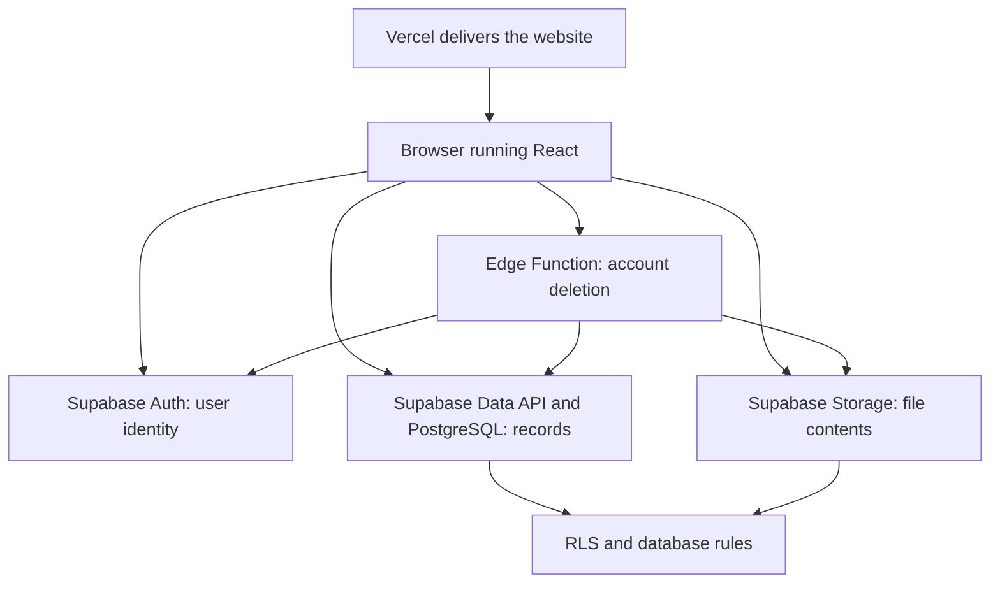
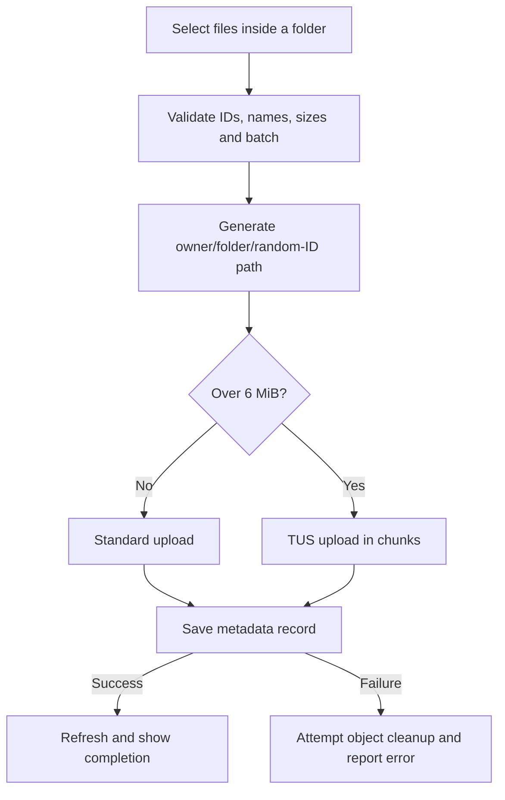

# 8bitSpace — Structure, Execution Flow, and Security

A beginner-friendly guide to how your app is built, why its parts exist, what happens when you use it, and where its security checks live.

**Prepared:** 12 September 2026. **Source:** this local repository, on `security/automated-safety-net`.

> **Current status:** This guide includes the security improvements prepared locally. They are not pushed or deployed. A rule written in a local SQL file does not protect the live database until it is applied. “New/local” below means implemented in this checkout, with production activation still pending.

## Contents

- [1. What the app is and its architecture](#1-what-the-app-is-and-its-architecture)
- [2. Technologies and why they are used](#2-technologies-and-why-they-are-used)
- [3. Project structure and file responsibilities](#3-project-structure-and-file-responsibilities)
- [4. Frontend components and state](#4-frontend-components-and-state)
- [5. Backend tables, files, and relationships](#5-backend-tables-files-and-relationships)
- [6. Execution flow when the website opens](#6-execution-flow-when-the-website-opens)
- [7. Execution flow for each feature](#7-execution-flow-for-each-feature)
- [8. All 20 security checks: what, why, where, and status](#8-all-20-security-checks-what-why-where-and-status)
- [9. Tests, linting, CI, and dependency checks](#9-tests-linting-ci-and-dependency-checks)
- [10. Build and deployment flow](#10-build-and-deployment-flow)
- [11. Limitations and remaining work](#11-limitations-and-remaining-work)
- [12. Where to make changes and a glossary](#12-where-to-make-changes-and-a-glossary)

## 1. What the app is and its architecture

8bitSpace is a personal cloud file manager. Users sign in, create folders, upload files, download or share them, star items, and use Trash. React displays the pixel-themed interface; Supabase handles accounts, permanent records, and file storage.

| Part | Job | Runs on |
|---|---|---|
| Frontend | Screens, forms, clicks, navigation, progress | The user's browser |
| Backend | Identity checks, permissions, database, file storage | Supabase |
| Hosting | Sends the built website to visitors | Vercel is this project's hosting target |
| Source control | Stores the application's code and its change history | GitHub |

User-uploaded documents go to Supabase, not into the GitHub repository or the frontend's `public` folder.



Most actions go directly from the browser to Supabase under the user's identity. Full-account deletion takes an extra server-side route because deleting an Auth user requires administrator privileges.

## 2. Technologies and why they are used

These are practical explanations of the current design, not a claim that every original decision was recorded when the app was first built.

| Tool | What it is | Why it is useful here |
|---|---|---|
| React | A way to build a screen from reusable components | Updates the screen when data changes without reloading the whole page |
| JavaScript + JSX | JavaScript handles behavior; JSX describes screen elements | Keeps each component's display and behavior together |
| CSS | Styling and layout instructions | Creates the pixel appearance, responsive layout, and animations |
| Vite | Development server and build tool | Makes editing fast and produces the release website |
| Supabase Auth | Managed account/login service | Avoids building password storage and login infrastructure from scratch |
| PostgreSQL | A database with related tables and enforceable rules | Fits user → folder → file relationships |
| Supabase Storage | Managed storage for file contents | Keeps large uploads separate from small descriptive database records |
| Supabase JavaScript client | A library for calling Supabase | Provides methods such as `insert`, `upload`, and `signInWithPassword` |
| Supabase Edge Functions | Hosted server-side functions | Runs privileged deletion logic outside the browser |
| Deno | The runtime for the Edge Function | Executes server requests and responses on Supabase |
| tus-js-client | Chunked/resumable upload library | Retries large uploads in smaller pieces |
| Lucide React | Icon library | Supplies folder, upload, trash, and other icons |
| Vercel | Frontend hosting | Delivers the built app and applies configured security headers |
| Node.js + npm | Development tools and package management | Install dependencies and run build/test commands |

### Is Spring Boot used?

**There is no Spring Boot implementation in this checkout.** There is no Java server, Maven/Gradle project, Spring controller, or Spring service. The GitHub description mentioning Spring Boot does not match the implementation reviewed here.

The backend is **Supabase Auth + PostgreSQL + Storage + an Edge Function**. Node.js is tooling here, not a custom Express server.

### Is everything TypeScript?

No. The frontend is mostly JavaScript/JSX. The Edge Function entry point is TypeScript, but its main handler is JavaScript. Installing TypeScript does not make the whole project type-checked. A Deno check of the function entry point passed locally; the current CI does not contain a separate Deno/type-check step.

`@vitejs/plugin-react` is installed, but the current Vite configuration does not register it. An installed package and an actively configured feature are different things.

## 3. Project structure and file responsibilities

All paths in the tree are relative to the repository containing this guide. Generated folders are shown for understanding; they are not application source.

```text
repo-review/
├── index.html
├── package.json
├── package-lock.json
├── deno.lock
├── .env.example
├── .gitignore
├── README.md
├── SECURITY.md
├── STRUCTURE-AND-EXECUTION-FLOW.md
├── vite.config.js
├── vercel.json
├── eslint.config.js
├── playwright.config.js
├── .github/
│   ├── dependabot.yml
│   └── workflows/security.yml
├── public/
│   ├── 8bitspace-background.mp4
│   └── avatars/                      # 12 built-in avatar images
├── src/
│   ├── main.jsx
│   ├── styles.css
│   └── lib/
│       ├── supabase.js
│       ├── cloud.js
│       └── security.js
├── supabase/
│   ├── README.md
│   ├── 8bitspace-setup.sql
│   ├── migrations/
│   │   └── 20260911094338_security_hardening.sql
│   └── functions/delete-account/
│       ├── index.ts
│       └── handler.js
├── scripts/scan-secrets.js
├── tests/
│   ├── security.test.js
│   ├── uploads.test.js
│   ├── rls.test.js
│   └── delete-account.test.js
├── e2e/security.spec.js
├── node_modules/                     # Downloaded dependencies
├── dist/                             # Generated production website
└── .browser-check/                   # Generated browser-test evidence
```

| File | What it does and why it exists |
|---|---|
| [index.html](index.html) | The starting HTML page. Contains the empty `root` element where React puts the app. |
| [src/main.jsx](src/main.jsx) | All main React components and screen-level action handlers. Coordinates what the user sees and does. |
| [src/styles.css](src/styles.css) | Colors, fonts, spacing, responsive rules, and animation. Separates styling from most behavior. |
| [src/lib/supabase.js](src/lib/supabase.js) | Creates one shared Supabase client so other files reuse the same connection configuration. |
| [src/lib/cloud.js](src/lib/cloud.js) | Folder, upload, profile, sharing, Trash, and deletion operations. Keeps most service calls out of components. |
| [src/lib/security.js](src/lib/security.js) | Reusable validation for names, IDs, upload sizes, avatars, and public configuration. |
| [supabase/8bitspace-setup.sql](supabase/8bitspace-setup.sql) | Original tables, relationships, RLS policies, indexes, and bucket settings. Defines the initial backend. |
| [supabase/migrations/20260911094338_security_hardening.sql](supabase/migrations/20260911094338_security_hardening.sql) | Adds new security rules and request counters to an existing backend. |
| [supabase/functions/delete-account/index.ts](supabase/functions/delete-account/index.ts) | Connects the deletion handler to the Deno/Supabase runtime. |
| [supabase/functions/delete-account/handler.js](supabase/functions/delete-account/handler.js) | Verifies and performs privileged account deletion; separated for easier testing. |
| [package.json](package.json) | Dependencies and runnable commands. Tells a developer what tools this project uses. |
| [package-lock.json](package-lock.json) | Exact npm dependency versions, so installations are reproducible. |
| [deno.lock](deno.lock) | Dependencies resolved by Deno when checking the Edge Function. |
| [.env.example](.env.example) | Configuration variable names without administrator credentials. |
| [.gitignore](.gitignore) | Excludes local secrets and generated output from normal Git tracking. |
| [vite.config.js](vite.config.js) | Build validation, preview headers, and Vitest configuration. |
| [vercel.json](vercel.json) | HTTP security headers applied by Vercel on deployment. |
| [eslint.config.js](eslint.config.js) | Rules for checking JavaScript/JSX mistakes. |
| [playwright.config.js](playwright.config.js) | Browser-test setup, local preview server, and screenshot output location. |
| [.github/workflows/security.yml](.github/workflows/security.yml) | Automatic checks after a push or pull request, once published. |
| [.github/dependabot.yml](.github/dependabot.yml) | Weekly dependency/action update checks once published. |
| [SECURITY.md](SECURITY.md) | Security status, testing boundaries, and deployment instructions. |

Your global `C:/Users/dhruv/.codex/AGENTS.md` tells Codex how to work, including your expanded security/testing checklist. The application itself does not execute that file.

## 4. Frontend components and state

Most components currently live together in `src/main.jsx`. They are separate functions, not separate component files yet.

| Component | Its job |
|---|---|
| `App` | Main controller: user, loaded data, navigation, dialogs, actions |
| `AuthScreen` | Sign-in, signup, and recovery-email request |
| `RecoveryScreen` | Enter a new password after a recovery link |
| `Sidebar` | My Cloud, Recent, Starred, Photos, Trash, Storage, Activity |
| `Header` | Welcome text, search, profile control |
| `FileBrowser` | File/folder list, grid view, breadcrumbs, upload controls |
| `CreateDialog` | Create or select a folder |
| `DetailsPanel` | Item information and actions |
| `AvatarPicker` | Account settings, avatar selection, account-deletion control |
| `ConfirmDialog` | Confirm a permanent action; account deletion also requires a password |
| `SpecialView` | Storage totals and activity history |
| `PixelLandscape` | Background video; pauses it for situations such as a hidden page |
| `IntroSequence` | Opening animation and skip control |
| `IconFor`, `ProfileAvatar` | Small reusable display helpers |

### What is state?

State is information React remembers while the page is open. `user` is the current account; `files` contains loaded records; `folderStack` tracks the open folder path; `selected` controls the details panel; `active` is the sidebar section; `uploadProgress` stores the percentage; `confirmation` controls deletion dialogs.

Browser state is not the permanent database. The app fetches permanent information again after reopening.

- `useState`: remember a value and redraw when it changes.
- `useEffect`: run work such as checking a session or loading records.
- `useMemo`: avoid unnecessarily repeating filtering.
- `useRef`: remember a value without requesting a redraw, such as the video element or current user ID.

The app is a **single-page application**. Switching to Trash changes the React view rather than loading a different HTML page. Search filters loaded names; it does not search inside document contents.

## 5. Backend tables, files, and relationships

### File contents versus metadata

Uploading `resume.pdf` saves two things: the actual PDF bytes in Storage, and a database record with the name, owner, folder, size, and storage path. The descriptive record is called **metadata**.

This separation makes files easy to list and organize without downloading every document.

| Backend location | What it contains |
|---|---|
| `auth.users` | Identities managed by Supabase Auth |
| `public.profiles` | Display name, avatar location, theme and notification preferences |
| `public.folders` | Folder name, owner, parent, starred/trash state, timestamps |
| `public.files` | Filename, owner, folder, storage path, type, size, starred/trash state |
| `public.activity` | Recent action labels and subjects |
| `storage.buckets` | Bucket privacy, per-file limits, avatar type settings |
| `storage.objects` | Supabase's records describing stored objects, used for Storage policies |
| `space-files` bucket | Actual uploaded documents and other files |
| `profile-avatars` bucket | Actual uploaded profile images |
| `private.request_windows` — new/local | Per-account action counts and time windows |
| `private.upload_attempts` — new/local | Upload paths already counted recently |

A schema is a named group of database objects. The schema name `public` does **not** mean anybody can read the rows; permissions and RLS decide access.

```text
Auth user
├── Profile
├── Folders
│   ├── Child folders: parent_id
│   └── File records: folder_id
│       └── Storage object: storage_path
└── Activity records
```

A **foreign key** requires a referenced record to exist. Here, folder relationships include the owner ID, preventing your file from referencing another user's folder.

A **cascade delete** automatically deletes related database records when their parent is deleted. It does not automatically erase Storage bytes; application code must remove those separately.

An **index** speeds up common database lookups. The setup adds indexes for a user's folders, active files, Trash, starred files, and activity.

## 6. Execution flow when the website opens

1. The browser requests the site from the host.
2. The host sends `index.html` and built JavaScript/CSS.
3. The code originating from `src/main.jsx` runs.
4. `createRoot(...).render(...)` inserts the React app into the HTML `root` element.
5. `supabase.js` reads the project URL/public key and creates the client.
6. `App` checks for an existing session and listens for Auth events.
7. Missing configuration shows a setup message; no session shows sign-in; a recovery flow shows the password screen.
8. A signed-in account triggers `refresh()` → `loadCloud(user)`.
9. Folders, files, the latest 50 activity entries, and the profile are requested together.
10. Supabase applies permissions and RLS before returning records.
11. If the profile is missing, the app creates one for this account.
12. Sizes/timestamps are formatted, the avatar URL is prepared, and recorded usage is totalled.
13. React stores the results and draws the dashboard.

Most mutations trigger another refresh. The app does not currently subscribe to realtime database-change events.

## 7. Execution flow for each feature

### 7.1 Signup and sign-in

**Where:** `AuthScreen` in `main.jsx` and the client in `supabase.js`.

Email/password → `signUp` or `signInWithPassword` → Supabase verifies/creates the account → a session is returned when permitted → the Auth listener updates `user` → cloud data loads.

If hosted email confirmation is enabled, a new account may need to follow a confirmation email before receiving a session.

An **access token** accompanies requests as proof of login. A **refresh token** helps obtain a fresh access token later. Supabase JS persists the session in browser storage. The project's public key alone does not establish a logged-in identity.

### 7.2 Creating a folder

**Where:** `CreateDialog` → `createFolder` → `createCloudFolder` in `cloud.js`.

Name entered → validate name and IDs → insert owner/optional parent/name → database checks ownership and relationships → attempt activity entry → refresh the list.

The new migration also enforces its write limit. A folder is represented by a database record, not a new directory on your laptop.

### 7.3 Uploading files

**Where:** `uploadFiles` → `uploadCloudFiles` → Storage → database.



The visible name may be `resume.pdf`, but its object path looks like:

```text
user-ID/folder-ID/random-file-ID.pdf
```

Random names prevent accidental collisions and keep user-controlled filenames out of most of the storage URL. The original name remains in the database for display/download.

New/local validation checks all selected files before starting: 1–30 files per batch, maximum 100 MiB per file. The UI calls this 100 MB; the exact limit is 104,857,600 bytes.

Files over 6 MiB use TUS with 6 MiB chunks and retry delays. The fingerprint includes the destination to avoid resuming the wrong upload. A new action generates a new random destination, so full page-reload resume is not guaranteed.

After Storage succeeds, the metadata row is inserted. New SQL rules require an existing object with the matching owner and byte size. If insertion fails, the client tries to delete the uploaded object and reports cleanup failure when detected.

Storage plus database insertion is not one atomic operation. Earlier files in a batch may succeed before a later one fails.

### 7.4 Listing, searching, and navigation

**Where:** `loadCloud` and `FileBrowser`.

The browser filters the loaded records: My Cloud shows root folders/current children; Starred checks `is_starred`; Trash checks `trashed_at`; Photos includes images and videos. Recent uses loaded non-trashed items; it is not a separate “recently opened” tracking service.

Breadcrumbs come from `folderStack`. List/grid changes are display changes. The details panel shows an icon and metadata, not a full document-content preview.

### 7.5 Downloading and sharing

**Where:** `fileAction` → `signedFileUrl`.

Click action → Supabase checks object access and makes a signed URL → Download opens a 5-minute link; Share copies a 1-hour link → new/local code requests attachment download rather than active file rendering.

A **signed URL** carries temporary permission. **Anyone who obtains a valid link can use it until expiry.** It is not restricted to a named recipient.

The helper rejects lifetimes over an hour, but that is an app-side restriction, not a proven maximum for every direct Storage API call.

### 7.6 Star, Trash, and restore

**Where:** `setCloudStar` and `setCloudTrash`.

Star toggles `is_starred`. Trash sets `trashed_at` to a timestamp. Restore clears it. Trash leaves the actual bytes in Storage and still consumes space.

For folders, the code finds descendants and updates the related folder/file records. These are several requests, not one atomic tree-wide transaction. Marking an item trashed does not immediately revoke previously issued signed URLs.

### 7.7 Permanent item deletion

**Where:** `ConfirmDialog` → `permanentlyDeleteCloudItem`.

Confirm → remove the stored file → delete its record → attempt activity logging → refresh.

For a folder, the app finds descendant file paths, removes objects in batches, then deletes the folder and related records through database cascades. These operations use the user's permissions, not an administrator key in the browser.

### 7.8 Profile and avatar updates

**Where:** `AvatarPicker` → `saveCloudProfile`.

Validate name → choose built-in avatar or validate an upload → upload replacement → save the profile → attempt old-avatar removal after save succeeds → obtain a signed URL for display.

New/local avatar validation checks size, declared format, and initial PNG/JPEG/WebP bytes. It is not antivirus scanning or full image decoding. Some avatar cleanup failures are still not surfaced to the user.

Theme/notification preferences are stored, but that does not establish a complete theme-switching or notification-delivery service.

### 7.9 Recovery, email change, and logout

**Where:** `AuthScreen`, `RecoveryScreen`, and profile handlers in `main.jsx`.

- Recovery: request email → follow configured link → enter matching new passwords → `updateUser({password})` → sign out → sign in again.
- Email change: `updateUser({email})`; confirmation behavior depends on hosted settings.
- Logout: call sign-out, clear displayed private state, and show sign-in.

The local refresh handler checks the current user ID before accepting a completed response, reducing the risk of displaying results from a previous account after switching users.

### 7.10 Full-account deletion

**Where:** `ConfirmDialog` → `deleteCloudAccount` → Edge Function `index.ts` → `handler.js`.

The **new/local** flow is:

1. Type `DELETE ACCOUNT` and enter the current password.
2. Send JSON and the login token to the Edge Function.
3. Check the website origin, HTTP method, token header, JSON content type, and body size.
4. Verify the user through Supabase Auth instead of trusting a submitted user ID.
5. Apply the account's 5-attempt/minute deletion limit.
6. Verify the password against the verified user's email.
7. List and remove objects only under that user's prefix in both buckets, including paginated results.
8. Request global sign-out, then delete the Auth account.
9. Related database records follow cascade rules; the browser returns to sign-in.

The server holds the administrator credential because deleting an Auth user is privileged. The older handler trusted editable file-record paths; the new handler derives targets from the verified user's storage namespace.

Sign-out revokes refresh access but does not universally invalidate existing access tokens instantly by itself. Storage cleanup, account deletion, and ownership rules also matter. This sequence can partially fail and reports failure rather than pretending everything was deleted.

## 8. All 20 security checks: what, why, where, and status

**Existing:** present in the original code. **New/local:** added in this branch, not deployed. **Hosted:** configured outside the source files. This section maps the implementation; it is not a guarantee about every live setting.

### 1. Hide API keys

**What:** Keep administrator credentials out of browsers and public repositories.

**Why:** An administrator key can bypass ordinary access rules.

**Where:** `publicConfig` in `src/lib/security.js`, `src/lib/supabase.js`, and server-only environment access in `handler.js`.

**Status:** Existing separation plus new/local rejection of secret/service-role keys in frontend configuration. Publishable keys are intentionally visible: they identify the project, not permission to read everyone's files.

### 2. Check environment variables

**What:** Validate the configuration values used to connect services.

**Why:** Missing or unsafe settings can break the app or expose privileges.

**Where:** `.env.example`, `publicConfig`, and `vite.config.js`.

**Status:** New/local production-build validation. `VITE_` values are included in browser builds, so they must never contain administrator secrets.

### 3. Check keys in Git

**What:** Scan current files and available history for exposed credentials.

**Why:** Deleting a key from today's file does not erase older commits.

**Where:** `.gitignore`, `scripts/scan-secrets.js`, `.github/workflows/security.yml`.

**Status:** New/local scanning found no matching secret patterns in the review. It detects selected formats, not every possible credential. A real exposed key would need rotation/revocation.

### 4. Protect admin routes

**What:** Restrict operations that possess administrator power.

**Why:** They may bypass the permissions ordinary users have.

**Where:** `supabase/functions/delete-account/handler.js`; the migration's `consume_delete_attempt` function.

**Status:** No separate admin dashboard exists. The new/local deletion handler requires verified identity and password. Only `service_role` can call the deletion-rate database helper.

### 5. Add authentication

**What:** Establish who is making the request.

**Why:** Private storage needs a trusted account identity.

**Where:** `AuthScreen`, `RecoveryScreen`, `supabase.js`, Supabase Auth, and the deletion handler.

**Status:** Existing login/signup/recovery. New/local 12-character signup/recovery form minimum and deletion-password requirement. The hosted minimum must also be configured; browser validation can be bypassed.

### 6. Check user permissions

**What:** Decide which records/objects a logged-in person may access.

**Why:** Signing in must not grant access to someone else's data.

**Where:** RLS policies in `8bitspace-setup.sql`, ownership relationships, the new migration, and `tests/rls.test.js`.

**Status:** Existing owner-based RLS plus local strengthening. Authentication asks “who are you?” Authorization asks “may you do this?”

### 7. Sanitize and validate user inputs

**What:** Reject invalid names, IDs, sizes, and locations.

**Why:** User input must not choose arbitrary storage targets or create invalid records.

**Where:** `cleanName`, `requireId`, `safeExtension`, `validateUpload`, `safeAvatar`, SQL constraints, and `private.guard_write`.

**Status:** New/local checks. Names are normalized and validated, not treated as HTML. Browser checks give immediate feedback; database checks also protect direct API requests.

### 8. Protect against XSS

**What:** Prevent user-controlled content from becoming executable website code.

**Why:** Malicious page code could steal browser-held tokens or act as the user.

**Where:** React text rendering in `main.jsx`, avatar restrictions, `signedFileUrl`, and CSP in `vercel.json`.

**Status:** Existing React escaping plus new/local protections. The browser test uses a hostile-looking profile name and confirms it stays text. CSP permits inline styles needed by the interface but not arbitrary inline scripts.

### 9. Protect against SQL injection

**What:** Keep user data separate from database instructions.

**Why:** A filename must remain a value, not turn into a database command.

**Where:** Structured Supabase calls in `cloud.js` and typed SQL function arguments in the migration.

**Status:** Existing query approach retained. User-entered names are not concatenated into executable SQL statements.

### 10. Check database rules

**What:** Enforce valid relationships and writes inside the database.

**Why:** A person can call an API without using the React forms.

**Where:** Both SQL files: RLS, foreign keys, constraints, and `private.guard_write`.

**Status:** Existing relationships plus new/local rules requiring real owned uploads and matching sizes. File storage identity and folder ownership/parent cannot be changed through ordinary writes. Added `NOT VALID` constraints enforce new/updated rows but do not certify all historical rows.

### 11. Add rate limiting

**What:** Limit repeated actions per account in a time window.

**Why:** Reduces rapid automated writes, uploads, and deletion-password guessing.

**Where:** `private.request_windows`, `private.upload_attempts`, `consume_request`, `allow_upload`, and `consume_delete_attempt` in the migration.

**Status:** New/local: 30 distinct counted upload paths/minute, 300 covered metadata writes/minute, 5 deletion attempts/minute. These are server-side action limits, not a global/IP firewall or bandwidth cap. Failed transactions can roll back counters, so they do not count every incoming network attempt. Supabase Auth has separate service limits.

### 12. Set a spend cap

**What:** Configure provider billing and usage controls.

**Why:** File-size limits alone cannot prevent all high usage or costs.

**Where:** Supabase organization billing settings, outside the repository.

**Status:** The organization was verified as Free during the 11 September review. No plan/billing change was made. Pro spend caps are hosted settings and do not cover every charge; recheck current plan details before a paid release.

### 13. Secure file uploads

**What:** Control ownership, destination, size, appropriate file types, and failures.

**Why:** Storage accepts untrusted content and must prevent cross-user access, overwrites, and inconsistent records.

**Where:** `uploadCloudFiles`, `resumableUpload`, `validateUpload`, `validateAvatar`, bucket definitions, and `private.allow_upload`.

**Status:** Existing private buckets and per-file limits plus new/local checks. New object destinations require an owned, non-trashed folder. Avatars are restricted to image formats; general cloud files remain general files. Byte-signature checks are not antivirus or full image validation. No malware-scanning service is implemented.

### 14. CSRF protection

**What:** Prevent another website from silently using a visitor's login for a sensitive action.

**Why:** Browsers may automatically send some credentials, particularly cookies, without an intended action on your site.

**Where:** The deletion handler requires an explicit bearer token, JSON body, and allowed Origin.

**Status:** New/local endpoint controls. This SPA uses bearer tokens rather than custom cookie-authenticated endpoints, so it differs from a traditional cookie-session backend.

### 15. Check CORS

**What:** Control which website origins the endpoint permits in browser cross-origin requests.

**Why:** The deletion endpoint should accept the intended app origin, not every website.

**Where:** `corsHeaders` and the function's `ALLOWED_ORIGINS` environment setting.

**Status:** New/local; configure the exact origins at deployment. CORS is not user authorization: non-browser callers can supply headers. Identity and password checks are still required. Managed Supabase APIs have their own provider-controlled CORS behavior.

### 16. Enable HTTPS

**What:** Encrypt browser-to-service traffic.

**Why:** Helps protect credentials and files while they travel over the network.

**Where:** Production URL validation, Vercel hosting, HSTS and upgrade rules in `vercel.json`.

**Status:** New/local validation/header configuration; hosting must activate it. Local development may use HTTP on localhost.

### 17. Add security headers

**What:** Send browser protection instructions with the website response.

**Why:** The browser can block dangerous behaviors before application code handles them.

**Where:** `vercel.json`; `vite.config.js` applies the same headers to local production preview.

| Header | Purpose here |
|---|---|
| Content-Security-Policy | Restricts scripts, connections, images, fonts, frames, and other resource sources |
| Strict-Transport-Security | Tells browsers to use HTTPS after learning the host's policy |
| X-Content-Type-Options | Prevents guessing a different content type |
| X-Frame-Options | Blocks embedding the site in a frame |
| Referrer-Policy | Avoids sending the current page address as a referrer |
| Permissions-Policy | Disables unnecessary camera, microphone, geolocation, and payment permissions |

**Status:** New/local, tested in preview. Frontend headers do not automatically change responses served by Supabase Storage on a separate domain.

### 18. Secure cookies

**What:** Cookie-session apps use flags such as HttpOnly, Secure, and SameSite.

**Why:** These limit script access, insecure transport, and some cross-site cookie sending.

**Where here:** There are no custom authentication cookies. Supabase JS persists the session in browser storage.

**Status:** Not a cookie-setting task for this architecture. XSS can still expose browser-held tokens. Moving to HttpOnly sessions would require a different server/session design, not one checkbox.

### 19. Disable debug mode

**What:** Avoid exposing development-only output or unnecessary server details in a release.

**Why:** Such output may disclose sensitive implementation information.

**Where:** `vite.config.js` disables production source maps; the deletion handler uses generic server-failure messages.

**Status:** New/local settings. Browser JavaScript remains visible; source-map settings cannot hide secrets embedded in it. Activity logging still emits a warning on failure, so not all console output has been removed.

### 20. Check production settings

**What:** Confirm the code, database, hosting, and account configuration agree before release.

**Why:** Correct local code can be deployed incorrectly.

**Where:** `SECURITY.md`, `vercel.json`, the migration, function secrets, Supabase Auth, and GitHub repository settings.

**Status:** Code and instructions are local. Applying SQL, publishing the frontend/function, hosted Auth settings, required CI checks, and hosted smoke tests remain release work.

## 9. Tests, linting, CI, and dependency checks

### Tests: automatically try important scenarios

A test runs a scenario and compares the result with what should happen. Example: “User B must receive no rows when trying to read User A's files.” Tests help catch accidental breakage after code changes.

| File | What it checks | What it does not prove |
|---|---|---|
| `tests/security.test.js` | Names, IDs, sizes, avatar headers, unsafe configuration, secret recognition | That every file is malware-free |
| `tests/uploads.test.js` | Validation before upload, upload failure, cleanup failure, signed-link options | Real network uploads; the service is replaced with test doubles |
| `tests/rls.test.js` | Actual PostgreSQL RLS and triggers using two users | Complete hosted Supabase behavior; platform schemas are recreated minimally |
| `tests/delete-account.test.js` | Origin/token/password checks, limits, paths, pagination, errors | Deleting a real hosted account; service responses are mocked |
| `e2e/security.spec.js` | Chromium checks for anonymous UI access, short passwords, inert text, confirmation, headers | Production authentication; backend responses are mocked |

**Vitest** runs the first four files. **PGlite** provides an isolated PostgreSQL instance for the database tests. **Playwright** controls Chromium for the browser tests.

A **mock/test double** is a controlled replacement for a real service. It lets us test what the app does when an upload fails without deliberately breaking production storage.

The latest completed local checks passed **29 Vitest tests and 8 Playwright tests**, plus lint, secret scanning, dependency audit, and the production build. These are local results; GitHub CI will run the same checks after this branch is pushed.

### Linting: check code for common mistakes

Linting checks for issues such as undefined or unused variables. It does not log in, upload files, or prove RLS works.

**Where:** `eslint.config.js`. **Command:** `npm run lint`.

The linter and its configuration are now installed in the local branch. Previously, a script referred to ESLint without including the complete setup.

### Type checking: check expected kinds of values

A type checker can catch using a value in the wrong way before execution. It is different from testing behavior.

The Edge Function entry point passed a Deno check during the local review. The current GitHub workflow does not automate that separate check, and the JavaScript frontend is not comprehensively type-checked just because TypeScript is installed.

### Dependency auditing and updates

`npm audit --audit-level=high` checks package versions against known vulnerability reports. The reviewed local audit reported zero vulnerabilities; new advisories can change that result later.

Pinned dependencies and `package-lock.json` help different machines use the same versions. `.github/dependabot.yml` schedules weekly npm and GitHub Actions update checks once published. Updates still need compatibility review and testing.

### Secret scanning

`npm run security:scan` runs `scripts/scan-secrets.js` against current files and fetched Git history. It reports suspicious file locations without printing secret values. It also checks for tracked environment files.

This detects selected credential formats. It cannot prove the absence of every possible kind of secret.

### CI: Continuous Integration

CI means GitHub automatically runs verification when code is pushed or a pull request is opened.

**Where:** `.github/workflows/security.yml`.

```text
Push or pull request
  → check out code and history
  → prepare Node.js 24
  → install exact dependencies using npm ci
  → scan for secrets
  → run ESLint
  → run Vitest and isolated PostgreSQL tests
  → audit dependencies
  → build the frontend using test public configuration
  → install Chromium
  → run browser tests
```

A failing step makes the job fail. Blocking merges additionally requires GitHub branch-protection settings; those have not been configured here.

The workflow has read-only repository permissions and pinned action revisions. It does not deploy the app, migrate production, or use production secrets. CI configuration starts running on GitHub after this branch is published.

## 10. Build and deployment flow

### Commands and their meanings

| Command | Meaning |
|---|---|
| `npm ci` | Install the dependency versions recorded in the lockfile |
| `npm run dev` | Start the local development website |
| `npm run lint` | Run ESLint |
| `npm test` | Run the Vitest suite, including isolated SQL tests |
| `npm run test:watch` | Keep Vitest running while editing |
| `npm run security:scan` | Check current files and fetched history for known secrets |
| `npm audit --audit-level=high` | Check dependency advisories |
| `npm run build` | Generate `dist`; requires valid public Supabase configuration |
| `npm run preview` | Serve the generated production build locally |
| `npx playwright install chromium` | Install the browser used by the browser tests |
| `npm run test:browser` | Run Playwright against the built website |

Current browser fixtures expect the project origin used by the CI build and mock its responses. Do not replace fixtures with real user credentials.

### Build time versus runtime

**Build time:** Vite reads source code and public configuration and creates optimized files in `dist`.

**Runtime:** A visitor's browser executes the built JavaScript and calls Supabase. The Edge Function executes separately on Supabase when requested.

Changing a Vercel `VITE_` variable generally requires rebuilding because its value is included in the browser files. Server-only function secrets belong in the function environment, not in Vite variables.

### How the new security changes must be released

1. Review and apply the security migration to an already-initialized database.
2. Configure the function's exact `ALLOWED_ORIGINS` value.
3. Coordinate the deletion-function and frontend releases: the new handler needs a password that the older UI did not send.
4. Configure hosted Auth password rules and review confirmation, redirect, and request-limit settings.
5. Publish the code so GitHub can run CI, then release the verified frontend.
6. Test real small/large uploads, account separation, recovery, and deletion using disposable accounts.

For a new backend, run `8bitspace-setup.sql` before the security migration. Do not rerun the original setup after hardening: it recreates older Storage policies. The migration is an upgrade script, not a repeatedly rerunnable setup command.

See [SECURITY.md](SECURITY.md) for operational details. No deployment was performed when preparing this guide.

## 11. Limitations and remaining work

These boundaries help you describe the project accurately and understand what future improvements would add.

- **Local versus live:** the new security code, tests, and workflow remain unpublished/unactivated.
- **Hosted configuration:** browser validation does not prove hosted Auth settings or required GitHub checks are enabled.
- **Storage verification:** isolated SQL tests do not exercise the hosted Storage/TUS HTTP service; real hosted checks are still needed.
- **Sharing:** links grant temporary bearer access, not named-recipient collaboration or permanent revocable share records.
- **Trash:** metadata changes do not erase bytes or instantly revoke existing links.
- **Upload recovery:** retries exist, but a new upload action creates a new destination, limiting full reload recovery.
- **Partial failures:** upload, folder-tree changes, and deletion involve multiple requests and can partially complete.
- **Content safety:** no antivirus, deep image decoding, or content-disarm service is present.
- **Usage:** totals use file metadata, including Trash. They are not a provider billing total and may omit avatars/orphaned objects. There is no fixed enforced total-storage quota per user.
- **Scale:** records are loaded into the browser without complete pagination for very large accounts. Provider row limits can become relevant.
- **Activity:** this is convenient user history, not an immutable security audit log. Users have ownership-based access and can delete activity rows; logging can fail independently.
- **Preferences:** storing notification/theme values does not implement all notification delivery or theme behavior.
- **Code organization:** most UI is in one file, which becomes harder to maintain as features grow.
- **Moving files/folders:** new rules intentionally prohibit changing file identity and a folder's parent. A future move feature needs a designed and tested backend change.
- **Paid protection:** leaked-password protection was unavailable on the Free plan during the review. Check current provider features before making a plan decision.

## 12. Where to make changes and a glossary

### Where should you start?

| You want to change… | Look at… |
|---|---|
| Visual design and mobile layout | `src/styles.css` and the relevant component in `main.jsx` |
| Login/signup/recovery screens | `AuthScreen` / `RecoveryScreen`; hosted Auth for server rules |
| Search, navigation, list/grid | `FileBrowser` and `App` |
| Upload handling/cleanup | `uploadCloudFiles` and `resumableUpload` in `cloud.js` |
| Input checks | `security.js` and SQL checks for server enforcement |
| Who can access records/files | RLS policies, relationships, and `tests/rls.test.js` |
| Avatar updates | `AvatarPicker`, `saveCloudProfile`, avatar bucket rules |
| Full-account deletion | Edge Function handler, confirmation dialog, deletion tests |
| Link lifetime/download behavior | `signedFileUrl` and `fileAction` |
| Request limits | Security migration; a browser-only counter would not be enough |
| Headers/allowed connections | `vercel.json` |
| Automated checks | `.github/workflows/security.yml`, `tests`, and `e2e` |
| Codex development instructions | Global `C:/Users/dhruv/.codex/AGENTS.md` |

### Small glossary

| Term | Simple meaning |
|---|---|
| API | A way to ask another service to do something |
| Backend | Services that enforce rules and keep permanent information |
| Bucket | A named storage area for uploaded objects |
| Component | A React function representing part of the screen |
| Constraint | A database rule rejecting invalid data |
| CI | Automatic verification when code changes are published |
| CORS | Browser rules concerning access across website origins |
| Edge Function | Hosted server-side code responding to requests |
| Foreign key | A rule connecting one record to another existing record |
| JSON | A text format for structured data sent between services |
| JWT | A signed token format used for login-related claims |
| Metadata | Information about a file instead of its contents |
| Migration | A versioned change to database structure or rules |
| MIME type | A format label such as `image/png` |
| Mock | A controlled substitute for a real service in a test |
| RLS | Row-Level Security: the database filters/rejects records based on the caller |
| RPC | Calling a database function through an API |
| Schema | A named group of database tables/functions |
| Signed URL | A link containing temporary permission for a private object |
| Trigger | Database code that automatically runs for a specified write |
| UUID | A long identifier used for users, folders, and objects |
| XSS | Untrusted content becoming executable website code |

### A useful reading order

Start with a screen/action in `main.jsx`, follow it into `cloud.js`, then inspect the SQL for the server-enforced rules. For account deletion, follow the call into the Edge Function. Read the corresponding tests to see concrete accepted and rejected scenarios.

### Sources for this guide

The implementation descriptions come from this checkout's files linked above. Test results and deployment status come from the completed local review and `SECURITY.md`; this document is not a new live security audit.

Official references for deeper reading: [Supabase Storage access control](https://supabase.com/docs/guides/storage/security/access-control), [Supabase password security](https://supabase.com/docs/guides/auth/password-security), and [Supabase cost controls](https://supabase.com/docs/guides/platform/cost-control).

## 13. Change log — Google/GitHub sign-in (12 September 2026)

This section tracks the new request. The earlier local security work is still unpublished. GitHub metadata edits are separate from application deployment.

### Step 1 — Check the implementation and correct GitHub

Reviewed the current React/Supabase authentication and official provider/PKCE documentation. Removed the unsupported Spring Boot claim from the live GitHub About description and verified the saved result. The existing live README already describes React, Vite, and Supabase; no Java backend is being added.

### Step 2 — Implement the provider flow (complete locally; paused before hosted setup)

Added Google and GitHub buttons through Supabase Auth, PKCE for the return flow, and safe cancellation/error feedback. Provider credentials belong in Supabase configuration, never in VITE variables. Account deletion explicitly requests an 8bitSpace password and offers a password setup/reset email; it never requests the provider password.

### Pause checkpoint — 12 September 2026

Paused at the owner's request before hosted setup. Code is saved locally, uncommitted and unpushed. No production database, function, or frontend deployment was performed.

- `src/lib/auth.js`: provider allowlist, provider availability check, fixed return URL, validated Supabase redirect destination, and safe callback cleanup.
- `src/lib/supabase.js`: PKCE enabled. The browser creates a temporary secret; Supabase JS uses it to exchange the returned code for a session.
- `src/main.jsx` and `src/styles.css`: provider buttons, loading/error feedback, callback handling, mobile layout, and password setup/reset help for deletion.
- `tests/auth.test.js` and `e2e/security.spec.js`: provider options and browser redirect/error/layout checks.
- Latest verification: **29 unit/database tests and 8 Chromium browser tests passed**, plus lint and production build. Earlier test counts in this guide describe the previous checkpoint. Browser tests mock provider responses; real Google/GitHub sign-in is not verified yet.
- Both providers were disabled in Supabase when inspected. The GitHub OAuth registration form is filled but not submitted. Google Cloud initially failed to load and showed an updated Terms notice; a retry was attempted. No new terms were accepted and no client secrets were created.
- The live GitHub About description was corrected to React, Vite, and Supabase; the unsupported Spring Boot claim was removed. Application code has not been published.

Resume with provider registration/configuration and exact redirect allowlisting, then real-provider verification and a coordinated release. Provider callback: `https://sajbwbtqlassnipnbdkk.supabase.co/auth/v1/callback`. Production app: `https://8bit-space-a-pixel-themed-cloud-sto.vercel.app`; OAuth return path: `/?auth=callback`. Keep credentials out of code and documentation. Credential entry requires an owner handoff under the browser tool's rules.

Documentation follow-up: update the earlier architecture/authentication sections, test counts, README, and SECURITY.md to reflect this checkpoint; add a repository instruction requiring future changes to update this guide. That broader documentation synchronization was not completed before this requested pause.
